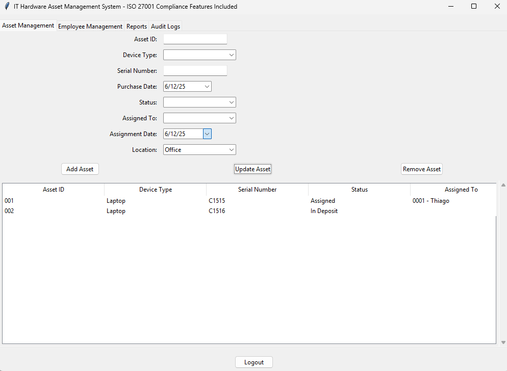
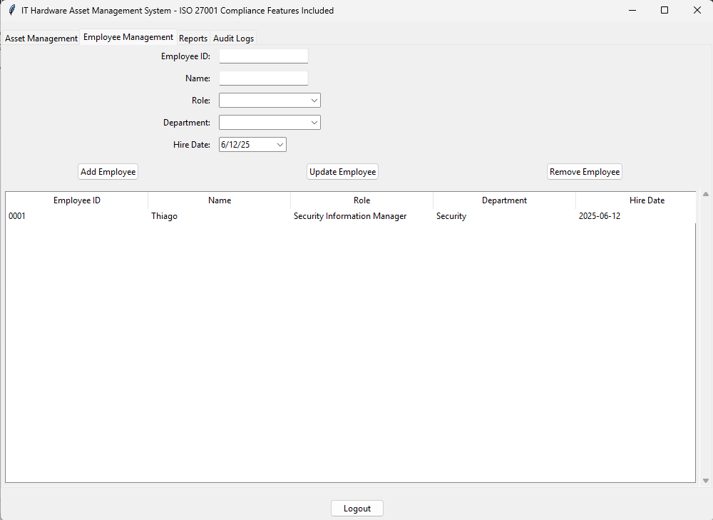
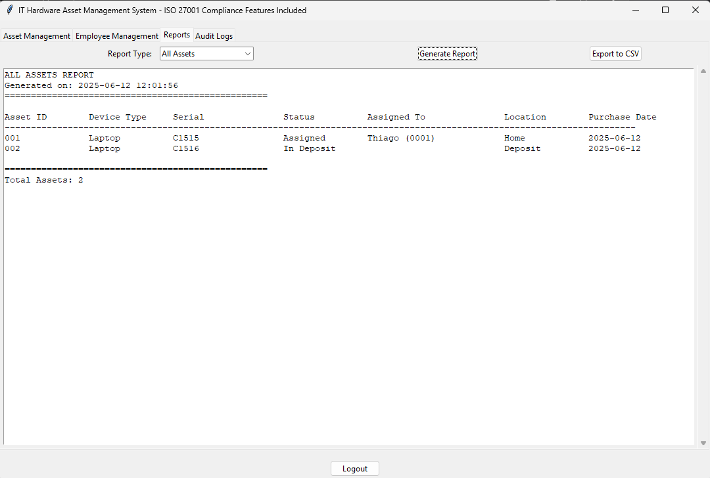
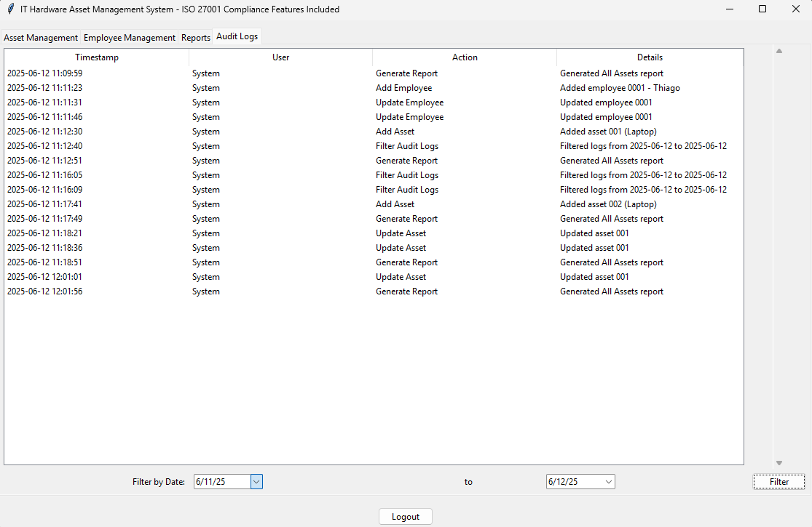

# IT Hardware Asset Management System (ISO 27001 Compliant features)

IT asset management is about content, creating an inventory of what we have, and keeping track of how we use it. 
A hardware (computer focused) asset management system with ISO 27001 compliance features, including role-based device permissions and audit logging.

<table>
  <tr>
    <td></td>
    <td></td>
    <td></td>
    <td></td>
    <td></td>
  </tr>
  <tr>
    <td style="text-align: center;">1 </td>
    <td style="text-align: center;">2 </td>
    <td style="text-align: center;">3 </td>
    <td style="text-align: center;">4 </td>
    <td style="text-align: center;">5 </td>
  </tr>
</table>

## Features

- **ISO 27001 Compliance**: Built with metadata tracking (creation date, owner, classification)
- **Role-Based Device Permissions**: Strict control over which devices can be assigned to which roles
- **Comprehensive Tracking**: Asset lifecycle from purchase to assignment to retirement
- **Audit Logging**: All actions are recorded with timestamps for compliance
- **Reporting**: Multiple report types for asset tracking and management

## Role-Based Device Permissions

The system enforces strict device assignment rules based on employee roles:

| Role                          | Allowed Devices               |
|-------------------------------|-------------------------------|
| Attendant (Office)            | Desktop, Headset              |
| Attendant (WFH)               | Desktop, Headset              |
| Manager                       | Laptop, Smartphone            |
| Coordinator                   | Laptop, Smartphone            |
| Supervisor                    | Desktop                       |
| IT Manager                    | Laptop, Desktop               |
| IT Analyst                    | Laptop, Desktop               |
| Security Information Manager  | Laptop                        |
| Human Resources               | Desktop                       |
| Security Guard                | Walkie-Talkie                 |  

> [!NOTE]
> 💡 **Want to add free role permissions?**   
> Consider SPONSOR ME! 😄  
>    

### Let's talk:
🤵🏽[LinkedIn: thiago-cequeira-99202239](https://www.linkedin.com/in/thiago-cequeira-99202239/) \
🤗[Hugging Face: ThiSecur](https://huggingface.co/ThiSecur)
