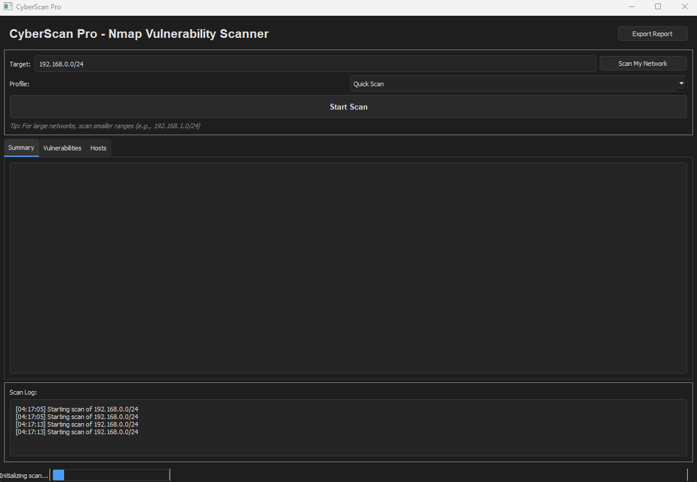

 [](#) [](#)   
 [](#) [](#)
 [](#)   
         
 [](https://www.linkedin.com/in/thiago-cequeira-99202239/) [](https://huggingface.co/ThiSecur) [](https://github.com/sponsors/ThiagoMaria-SecurityIT)     
  
 


# AI for Cybersecurity Demo - Under Development  

# CyberScan Pro - Nmap Vulnerability Scanner

     

## Transparency  
- 📅 Repository created: July 20, 2025    
- This project was created with the assistance of DeepSeek's AI model   
- Code was reviewed and refined by human developers to ensure:
   - Security best practices  
   - Functional correctness  
   - Production readiness

## Why This Matters
I believe in transparent AI-human collaboration. While AI accelerates development, human expertise ensures:  
✅ Real-world applicability  
✅ Ethical considerations  
✅ Compliance with security standards   
 
## Overview

CyberScan Pro is an advanced network vulnerability scanner with a modern dark UI, designed for cybersecurity professionals, network administrators, and IT teams. It leverages Nmap's powerful scanning capabilities while providing an intuitive graphical interface for vulnerability assessment.

**Key Purpose**:  
Automate network security audits by identifying open ports, services, and potential vulnerabilities across your infrastructure with enterprise-grade reporting.

## Features

- 🎯 **Automatic Network Detection**: Smart local network discovery
- 🔍 **Comprehensive Scanning**: Port, service, OS, and vulnerability detection
- 📊 **Interactive Results**: Three-tab view (Summary, Vulnerabilities, Hosts)
- 📁 **Multi-Format Reporting**: Export to HTML, JSON, or text
- ⚡ **Performance Optimized**: Parallel scanning and timeout controls
- 🛡️ **Safety First**: Confirmation prompts for large scans

## Target Audience

1. **Security Teams**: Regular network vulnerability assessments
2. **SysAdmins**: Infrastructure hardening and compliance checks
3. **Penetration Testers**: Initial reconnaissance phase
4. **IT Managers**: Visual security status reporting

## Installation

```
Clone this folder or download the files
```


# Install dependencies
pip install -r requirements.txt

**Requirements**:
- Python 3.8+
- Nmap installed on system
- Administrator/root privileges for full scanning

## Usage

### Basic Scanning
1. Launch the application:
   ```bash
   python nmap-vulnerability-scanner.py
   ```
2. Click **"Scan My Network"** for automatic local network detection
   - *or*  
   Enter specific target (IP/CIDR) manually
3. Select scan profile (Quick/Full/Vulnerability)
4. Click **"Start Scan"**

### Exploring Results
- **Summary Tab**: Overview of scan statistics
- **Vulnerabilities Tab**:  
  - Color-coded by severity (High/Medium/Low)
  - Sort by clicking column headers
- **Hosts Tab**:  
  - Left panel: List of discovered hosts
  - Click any host to view details in right panel

### Exporting Reports
1. After scanning, click **"Export Report"**
2. Choose format:
   - **HTML**: Visual report with color coding
   - **JSON**: Machine-readable raw data
   - **TXT**: Simple text format
3. Select destination and save

## Configuration

Edit `config.yml` to customize:
```yaml
scan:
  ports: "1-10000"  # Port range
  timing: 4         # Aggressiveness (0-5)
scripts:
  enable: true      # Vulnerability scripts
```

## Best Practices

1. Start with **Quick Scan** profile for initial assessment
2. Use **Vulnerability Scan** for in-depth security checks
3. For large networks:
   - Scan during off-peak hours
   - Use /24 subnets instead of larger ranges
4. Always verify results before taking action

## License

MIT License - See [LICENSE](LICENSE) file

---

## About the Author   

**Thiago Maria - From Brazil to the World 🌎**  
*Senior Security Information Professional | Passionate Programmer | AI Developer*

With a professional background in security analysis and a deep passion for programming, I created this Github acc to share some knowledge about security information, cybersecurity, Python and AI development practices. Most of my work here focuses on implementing security-first approaches in developer tools while maintaining usability.

__Click to Connect:__

[](https://www.linkedin.com/in/thiago-cequeira-99202239/)  
[](https://huggingface.co/ThiSecur)

---  

**Contributions welcome!** Please submit issues or pull requests for improvements.
## Ways to Contribute:    
 Want to see more upgrades? Help me keep it updated!    
 [](https://github.com/sponsors/ThiagoMaria-SecurityIT) 
