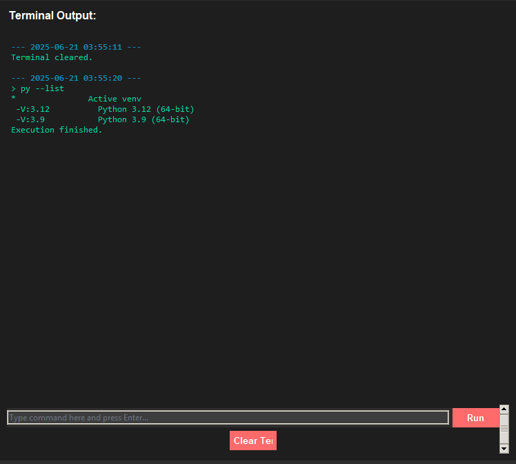

# Python & PowerShell VirtualEnv Cheat Sheet


A (Windows 11) **Tkinter-based GUI tool** designed to simplify the management of Python virtual environments and execution of PowerShell commands. Tailored for developers and IT professionals, this cheat sheet tool helps streamline common development tasks such as setting environment variables, generating commands, executing scripts, and more.

---

## Table of Contents

1. [Features](#features)
2. [Prerequisites](#prerequisites)
3. [Installation](#installation)
4. [Usage](#usage)
5. [Screenshots](#screenshots)
6. [Contributing](#contributing)
7. [License](#license)
8. [Acknowledgments](#acknowledgments)

---

## Features

This tool provides a user-friendly interface with the following functionalities:

- **Path Management**: Easily set paths for virtual environments, scripts, and Python executables.
- **Command Templates**: Predefined templates for common tasks like:
  - Creating and activating virtual environments
  - Installing packages
  - Running scripts
  - Building executables with PyInstaller
- **Terminal Integration**: Execute commands directly within an integrated terminal-like display.
- **Copy-to-Clipboard**: Quickly copy generated commands for use in external terminals.
- **Configuration Saving/Loading**: Save and load environment configurations for reuse.
- **Error Handling**: Detailed error messages and logging for troubleshooting.
- **Dark Theme**: Aesthetic dark theme optimized for readability and developer comfort.
- **Cross-Platform Support**: Works on Windows, Linux, and macOS.

---

## Prerequisites

- **Python 3.7+**: Ensure you have Python installed. You can download it from [python.org](https://www.python.org/downloads/).
- **Tkinter**: Comes bundled with Python by default.
- **Pyperclip**: For clipboard operations. Install via `pip install pyperclip`.
- **Subprocess Module**: For command execution (included in Python's standard library).

---

## Installation

1. **Clone the Repository**:
   ```bash
   git clone https://github.com/yourusername/virtualenv-cheat-sheet.git
   cd virtualenv-cheat-sheet
   ```

2. **Install Dependencies**:
   ```bash
   pip install -r requirements.txt
   ```

3. **Run the Application**:
   ```bash
   python main.py
   ```

---

## Usage

### Setting Paths

1. Open the application.
2. Enter the paths for:
   - **Virtual Environment**
   - **Script Path**
   - **Python Executable**
3. Use the "Browse" buttons to locate directories or files easily.
4.  You can change the  Default paths in this part of the code:

```python
# Default paths (can be pre-filled)
     self.env_entry.insert(0, os.path.expanduser(os.path.join("~", "Documents", "Projects", "my_project", "venv")))
     self.script_entry.insert(0, os.path.expanduser(os.path.join("~", "Documents", "Projects", "my_project", "script.py")))
     self.py_path_entry.insert(0, self._get_default_python_path())
```
### Generating Commands

- Navigate through the tabs (Basic Commands, Advanced Commands, etc.) to find pre-defined command templates.
- Click the **Copy** button to copy the formatted command to your clipboard.
- Click the **Execute** button to run the command in the integrated terminal.

### Terminal Output

- The terminal section displays the output of executed commands.
- You can also type custom commands into the terminal input field and press **Enter** or click **Run**.

### Saving/Loading Configurations

- Use the **File > Save Config** menu option to save your current paths and settings.
- Use the **File > Load Config** menu option to reload saved configurations.

### Toggling Pop-ups

- Enable or disable informational pop-up messages via the **Edit > Enable Pop-ups** menu.

---

## Screenshots

  
*The main interface with dark theme and command tabs.*

  
*Integrated terminal showing command output.*

*(Add actual screenshots of your application here.)*

---

## Contributing

I welcome contributions from the community! Here’s how you can help:

1. **Fork the Repository**: Start by forking this repository to your GitHub account.
2. **Create a Branch**: Create a new branch for your feature or bugfix.
   ```bash
   git checkout -b feature/your-feature-name
   ```
3. **Commit Changes**: Commit your changes with clear and concise messages.
4. **Push to GitHub**: Push your branch to GitHub.
5. **Create a Pull Request**: Submit a pull request describing your changes.

### Guidelines

- Follow the existing coding style and conventions.
- Write meaningful commit messages.
- Include tests for new features or bug fixes.
- Document any significant changes in the README.

---

## License

This project is licensed under the **MIT License**. See the [LICENSE](LICENSE) file for details.

---

## Acknowledgments

- **Tkinter**: For providing a robust GUI framework.
- **Pyperclip**: Simplifying clipboard operations.
---  
## About the Author   

**Thiago de Maria - From Brazil to the World 🌎**  
*Senior Security Information Professional | Passionate Programmer | AI Developer*

With a professional background in security analysis and a deep passion for programming, I created this repo share some knowledge about security information, cybersecurity, Python and development practices. Most of my work here focuses on implementing security-first approaches in developer tools while maintaining usability.

Lets Connect:

[](https://www.linkedin.com/in/thiago-cequeira-99202239/)  
[](https://huggingface.co/ThiSecur)

 
## Ways to Contribute:   
 Want to see more upgrades? Help me keep it updated!    
 [](https://github.com/sponsors/ThiagoMaria-SecurityIT)   
